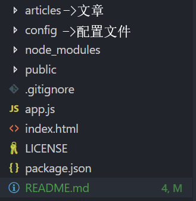

# A Blog in GitHub

## 特色

* 简便快速的部署
* 无需购买服务器
* markdown写作

## 环境搭建

1. 安装 **[git](https://git-scm.com/downloads)**
2. 建议安装 **[vscode](https://code.visualstudio.com/)**
3. **[直接下载项目压缩包](https://github.com/freetes/A-Blog-in-GitHub/archive/master.zip)** 到本地并解压
4. 文件夹目录如下
   
   
5. 配置文件
    ```json
    webConfig.json 博客信息配置
    {
      "title": "你的个人博客", // 博客标题
      "subtitle": "",         // 座右铭
      "end": "Hello,world"    // 最后的一段话
    }
    ```
    ```json
    artConfig.json 文章信息配置
    {
      "articles": [
        {
          "path": "./articles/about-site.md", // 文章路径
          "title": "关于本站",                 // 文章标题
          "subtitle": "",                     // 文章副标题
          "date": "2018/6/17 13:02"           // 写作时间
        },
        ...
      ]
    }
    ```
6. 在GitHub上新建 [用户名.github.io](https://freetes.github.io) 为名称的仓库
7. 使用 **git** 到将修改后的文件夹 **push** 到刚创建的仓库

## 新增文章

1. 在 **articles文件夹** 里新建**以.md结尾的markdown文件**([关于markdown的语法](https://freetes.github.io/#Markdown语法))
2. 写你想写的
3. 在 **artConfig.json** 里配置新增文章的信息
4. 使用 **git** 将修改后的项目 **push** 到自己的GitHub

## 未来计划

* 用react/vue重构
* 增加若干功能，例如：
  1. 更换主题功能
  2. 完善更多细节
  3. 等等

## 成功案例

* [作者的个人博客](https://freetes.github.io/)

#### [反馈与建议](https://github.com/freetes/A-Blog-in-GitHub/issues/new)

### Good luck
